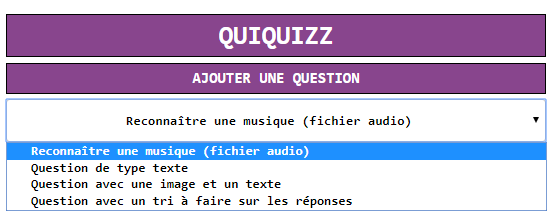
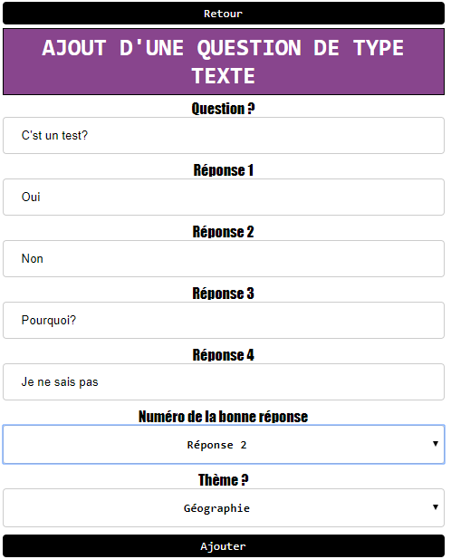
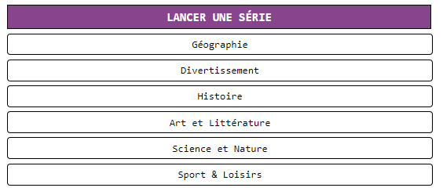
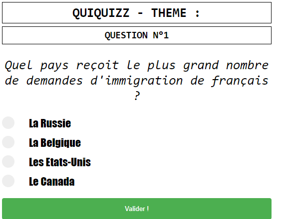
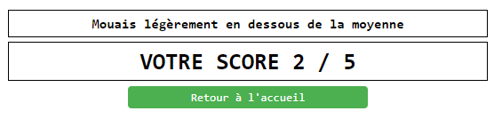

# Quizz-Angular

Quizz-Angular est un jeu dont le résultat ddépend de la capacité du joueur à répondre à des questions de culture générale, éventuellement dans un dommaine plus précis.

## Préquis

Pour lancer le projet vous n'avez besoin de rien, tout est dans le projet.


### Installation

Cloner le projet et lancer  index.html tout simplement.


## Ajouter une question

```
Crée une question
```


Vous avez le choix entre type de 4 type de question différente:
    - Un audio
    - Un texte
    - Une image et du texte
    - Un tri de texte
```
Exemple
```


## Lancer une série

Pour lancer une série il suffit de choisir la catégorie en question.



Il suffit de répondre au question.



Et à la fin vous avez votre score (Oui le mien n'est pas fameux).


